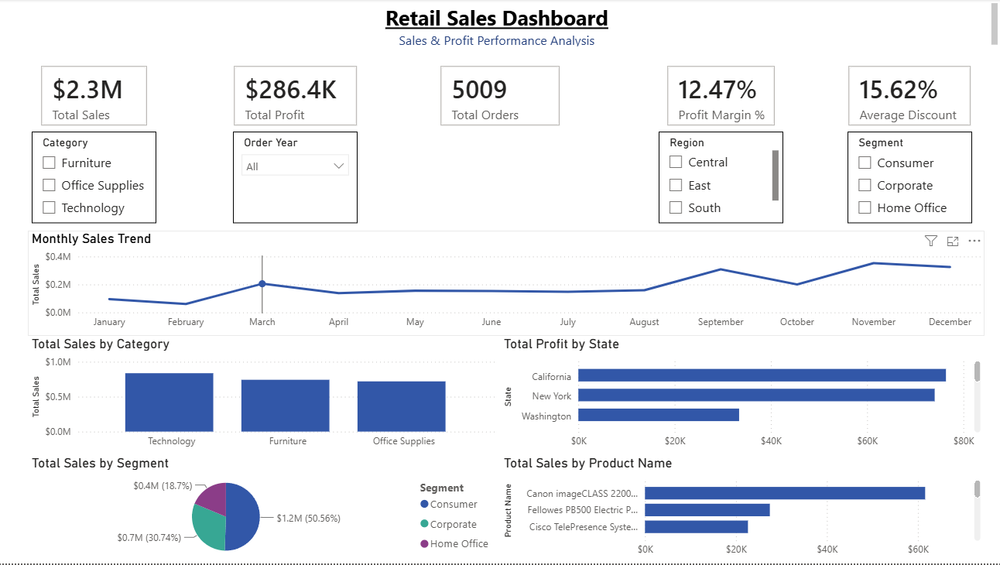
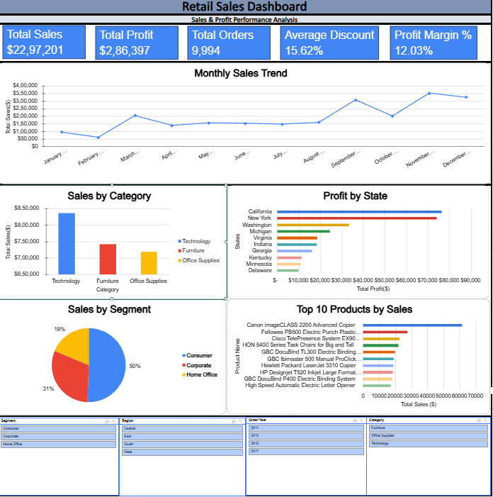
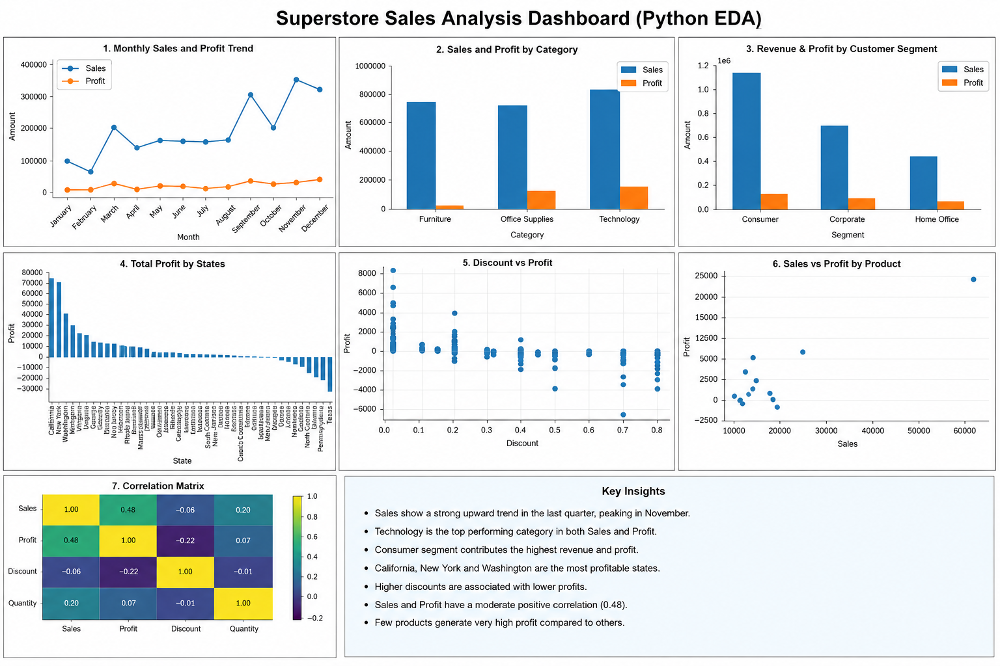

# 🛒 Retail Sales Performance & Profitability Analysis

## 📌 Project Overview

This project is an end-to-end Retail Sales Analytics solution built using **SQL, Python, Excel, and Power BI**. The objective was to analyze sales performance, identify profitability trends, and develop interactive dashboards that support data-driven business decision-making.

The project follows a complete analytics workflow—from data exploration and SQL analysis to dashboard development and business recommendations.

---

# 🎯 Executive Summary

### Business Problem

Retail businesses generate large volumes of transactional data, making it difficult to identify profitable products, sales trends, and customer purchasing behavior. This project analyzes retail sales data to uncover actionable insights that can improve revenue and profitability.

### Key Insights

- Technology is the highest-performing category by sales.
- Sales consistently peak during the fourth quarter, particularly in November.
- Consumer customers contribute the largest share of total sales.
- California and New York generate the highest overall profits.
- Higher discount levels are associated with lower profitability.

### Business Recommendations

- Review discount strategies for low-profit products.
- Increase inventory and marketing efforts during peak sales months.
- Focus customer retention initiatives on high-value customer segments.
- Invest in high-performing categories and profitable regions.

### Business Impact

The analysis provides decision-makers with clear visibility into sales performance, profitability trends, and customer behavior, enabling more informed pricing, inventory, and marketing decisions.

---

# 🏗️ Project Architecture

```text
Raw Retail Dataset (CSV)
          ↓
SQL Business Analysis
          ↓
Python Data Cleaning & EDA
          ↓
Excel Dashboard
          ↓
Power BI Dashboard
          ↓
Business Insights & Recommendations
```

---

## 🎯 Business Objectives

- Analyze overall sales and profit performance.
- Identify top-performing products and categories.
- Analyze monthly sales trends.
- Compare profitability across regions.
- Understand customer segment performance.
- Build interactive dashboards for business users.

---

## 🛠️ Tools & Technologies

- SQL (MySQL)
- Python (Pandas, Matplotlib)
- Microsoft Excel
- Power BI
- DAX
- Git & GitHub

---

## 📂 Dataset

**Dataset:** Sample Superstore Dataset

**Records:** Approximately 9,994 Orders

The dataset includes:

- Orders
- Customers
- Products
- Sales
- Profit
- Discount
- Regions
- Categories
- Shipping Information

---

# 📚 Business Metrics Dictionary

| Metric | Formula | Business Meaning |
|---------|----------|------------------|
| Total Sales | Sum(Sales) | Overall revenue generated |
| Total Profit | Sum(Profit) | Overall business profitability |
| Profit Margin % | Profit ÷ Sales × 100 | Measures profitability |
| Average Order Value (AOV) | Total Sales ÷ Total Orders | Average customer spend per order |
| Monthly Sales Growth | Month-over-Month Sales Comparison | Measures sales trend over time |

---

# 🧹 Data Cleaning Summary

| Issue | Action Taken |
|-------|--------------|
| Missing Values | Verified dataset for missing values before analysis |
| Duplicate Records | Checked and removed duplicate records where applicable |
| Data Types | Converted Order Date and Ship Date to date format |
| Data Validation | Verified sales, profit, and discount columns before analysis |
| Data Consistency | Confirmed categorical fields for accurate reporting |

---

## 🔄 Project Workflow

```text
Raw Data (CSV)
        ↓
SQL Analysis
        ↓
Python Exploratory Data Analysis (EDA)
        ↓
Excel Dashboard
        ↓
Power BI Dashboard
        ↓
Business Insights & Recommendations
```

---

# 📊 SQL Analysis

Business-oriented SQL queries were developed to answer key retail questions including:

- Sales Performance Analysis
- Profitability Analysis
- Customer Analysis
- Product Performance
- Window Function Analysis
- Business Classification
- Advanced SQL Analysis

Each query focuses on solving a practical business problem and generating actionable insights.

---

# 🐍 Python Analysis

Python was used for data exploration and visualization using **Pandas** and **Matplotlib**.

The notebook includes:

- Data Exploration
- Data Cleaning
- Exploratory Data Analysis (EDA)
- Sales Analysis
- Profitability Analysis
- Correlation Analysis
- Business Visualizations
- Business Insights

---

## 📈 Excel Dashboard

The Excel dashboard includes:

- KPI Cards
- Pivot Tables
- Pivot Charts
- Interactive Slicers
- Category Analysis
- Regional Performance
- Customer Segment Analysis
- Monthly Sales Trends

---

## 📉 Power BI Dashboard

The Power BI dashboard was developed using DAX measures and interactive visuals.

Key features include:

- KPI Cards
- Sales Dashboard
- Category Analysis
- Regional Performance
- Customer Segment Analysis
- Monthly Sales Trends
- Interactive Slicers
- Dynamic Filtering
- DAX Measures

---

# 📊 Key Business Insights

- Technology generates the highest sales revenue among all product categories.
- Sales performance peaks during the fourth quarter, indicating seasonal demand.
- Consumer customers contribute the largest portion of total revenue.
- California and New York are the most profitable states.
- Higher discounts generally reduce overall profit margins.

---

# 🚀 Business Recommendations

- Review pricing and discount strategies to improve profitability.
- Optimize inventory before seasonal demand periods.
- Focus marketing efforts on high-performing customer segments.
- Expand successful product categories and regions.
- Continuously monitor sales KPIs using interactive dashboards.

---

## 📸 Dashboard Screenshots

### Power BI Dashboard



---

### Excel Dashboard



---

### Python EDA Dashboard



---

## 🚀 Skills Demonstrated

### SQL

- Aggregate Functions
- GROUP BY & HAVING
- Joins
- Common Table Expressions (CTEs)
- Window Functions
- Ranking Functions
- Running Totals
- Month-over-Month Analysis

### Python

- Data Cleaning
- Exploratory Data Analysis (EDA)
- Data Visualization
- Correlation Analysis
- Business Insights

### Excel

- Pivot Tables
- Pivot Charts
- KPI Cards
- Slicers
- Dashboard Design

### Power BI

- Power Query
- DAX Measures
- Interactive Dashboards
- KPI Cards
- Data Modeling

### Business Analysis

- Sales Performance Analysis
- Profitability Analysis
- Customer Segmentation
- Product Performance Analysis
- Trend Analysis

---

# ⭐ Interview Story (STAR Format)

### Situation

A retail business needed better visibility into sales performance, profitability, and customer purchasing behavior across different products and regions.

### Task

Analyze retail transaction data, identify key business trends, and develop dashboards that support data-driven decision-making.

### Action

- Performed business-focused SQL analysis.
- Conducted exploratory data analysis using Python.
- Built interactive dashboards in Excel and Power BI.
- Analyzed product categories, customer segments, regional performance, and monthly sales trends.

### Result

The analysis identified high-performing products, profitable regions, seasonal sales trends, and the impact of discounting on profitability, enabling business stakeholders to make more informed decisions.

---

# 🔮 Limitations & Next Steps

### Current Limitations

- Historical sales data only.
- No real-time transaction data.
- Customer demographic information was limited.

### Next Steps

- Develop sales forecasting models.
- Incorporate customer lifetime value (CLV) analysis.
- Integrate real-time sales data into Power BI dashboards.

---

# 📌 Conclusion

This project demonstrates my ability to transform retail sales data into meaningful business insights using SQL, Python, Excel, and Power BI. It showcases the complete analytics workflow—from data preparation and exploratory analysis to interactive dashboard development and business storytelling.

---

## 📬 Author

**Sameer Sharma**

Aspiring Data Analyst

If you found this project helpful, feel free to ⭐ the repository.
